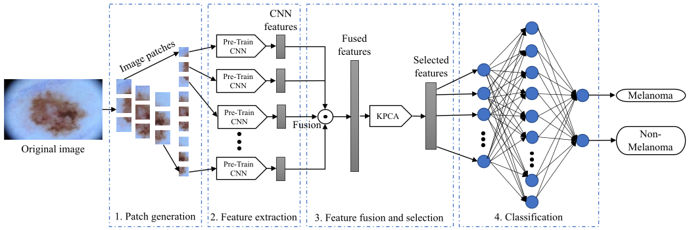
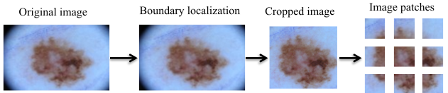
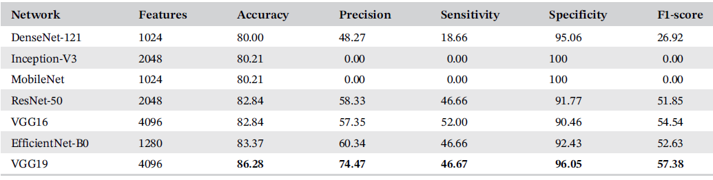

# Patch-based_local_deep_feature

Abstract:

Skin cancer detection through dermoscopy images has remained challenging due to higher inter-class uniformity and intra-class diversity. Deep convolutional neural networks (CNNs) have recently obtained remarkable attention for automated skin cancer classification; however, most of these methods extract features from the global image of high resolution. One of the major drawbacks of these methods is the downscaling of input images to a low resolution, which leads to information loss. Moreover, the lack of a vast number of dermoscopy images is a concern. To overcome these issues and improve the classification accuracy, we propose a novel method using patch-based local deep feature extraction. In the proposed method, the features are extracted from different patches of a dermoscopy image using a pre-trained CNN model and are fused to preserve fine details. The kernel principal component analysis is then employed to select the prominent features, and a feed-forward neural network is finally used to detect skin cancer. The approach is validated using two benchmark datasets: ISIC 2016 and ISIC 2017. The experimental results show that the suggested method achieves promising results in comparison  with state-of-the-art approaches. Moreover, a comparative analysis is made among contemporary pre-trained CNN models.

skin cancer classification has remained a challenging task due to the following reasons: limited training data, inter-class uniformity, intra-class diversity,9 and ineffective utilization of high-resolution images. CNN approaches require downscaling highresolution
input images to a lower resolution to make the network size computationally feasible. However, this process often leads to deprivation of image details, which is essential for identifying skin lesions. To address these issues, we propose a patch-based local deep feature extraction method for automated skin cancer classification. In the proposed method, a pretrained CNN model is applied over small regions (patches) of a high-resolution dermoscopy image which ensures extraction of local contextual information and overcomes the ineffective use of high-resolution images. Further, small patches are computationally light. The extracted features from all patches are fused using concatenation, resulting in a high-dimensional feature vector. A dimensionality reduction method is further employed to derive prominent features. Finally, a classifier is applied to perform skin cancer classification. 

The main contributions of this work are as follows:

1. We propose a patch-based local deep feature extraction approach that derives local contextual details from nonoverlapping patches of the skin lesions.
2. We employ a pre-trained CNN models to extract highlevel features from different patches of a dermoscopy image and fuse them using concatenation which facilitates the extraction of local contextual information. Subsequently, we harness kernel PCA to derive more
prominent features.
3. We validate the proposed method using two standard datasets and perform a comparative analysis among seven contemporary ImageNet pre-trained CNN models. Also, we compare the efficiency of the proposed method with state-of-the-art methods over the two datasets.

Proposed Methodology:

The proposed method mainly focuses on extracting relevant information from the region of interest (skin lesion area) identified by the boundary localization technique, ignoring irrelevant information. The architecture of the proposed method is described in Figure. The method has four major phases: (1) patch generation, (2) local deep feature extraction, (3) feature fusion and dimensionality reduction, and (4) forward neural network (FNN)-based classification.

Patch generation process:

Dermoscopy images are captured with high resolution, different sizes and affected by the various noises because of electronic dermatoscope that influence the originality of images. The high-resolution images are divided into small patches which ensure no information loss and lower computational overhead. In this approach, the dermoscopy images are divided into 224  224 nonoverlapping
patches. An example of the patches generation process of a sample dermoscopy image is depicted in Figure.

Results of different pretrained CNN models:

The results comparision has been shown in Table

The work is published in International Journal of Imaging Systems and Technology (SCIE), Wiley Online Library, 2022. You can find a entire paper by this link: https://onlinelibrary.wiley.com/doi/10.1002/ima.22729 
